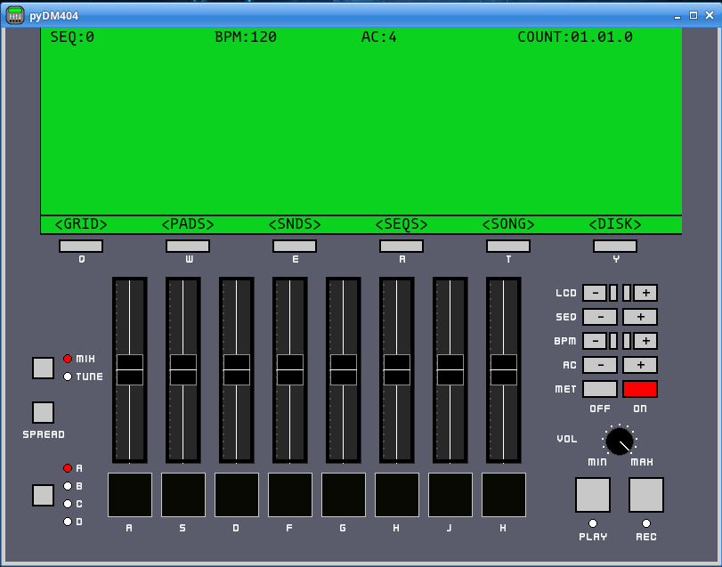

# pyDM404
The pyDM404 (or python Drum Machine 404) is a cross platform drum machine written in Python. The source code will run on any machine that can install its dependencies. Executable binaries are available for Windows (7/8/10 - Windows 11 is untested) and any Ubuntu based Linux 20.04 LTS (Focal Fossa) or greater. (May work with other debian based distros)

The pyDM404 is a semi-serious drum sequencer/machine program. The idea is to emulate the look, feel and use (not the sound) of 90’s drum machines. Therefore, the interface is meant to be limited and somewhat clunky. There are not a bunch of bells and whistles in terms of sound editing etc., but a user can create nice drum tracks with the pyDM404 or an entire song using samples.  

## What does pyDM404 mean?
py (python) DM (Drum Machine) 404, which is half of 808 (think TR-808), or a play on “resource not found” server responses.

## Why was the pyDM404 made?
It was made to provide a simple drum sequencer with sound editing features, that was cross-platform compatible and free to use. It was also an excuse to explore the Python library Pygame and to learn about building a whole application (and just for fun!)

**UPDATE**: Version 2.0 has been released!. Version 2.0 brings major changes to the application, and is not backwards compatible with Version 1.2 (or older) files.

See [Change Log](#Change-Log) for details and [releases](https://github.com/sitaber/pyDM404/releases) for the new executable.



# Features
- Tuning algorithm to adjust sounds by +/- 12 semitones
- Adjustable volume for each sound/channel
- Separate channels/choke groups, 8 in total (sounds in same group cut one another off)
- Up to 32 sounds loaded simultaneously
- A Metronome with clicks at fixed quarter note intervals
- Auto-correct/Quantize notes to: Quarter, 8th, 16th, 16th triplet, 32nd, 32nd triplets notes or "hi-rez"
- Real time recording
- "Step edit" mode (more like a clickable grid)
- Save and load with "disks"
- Sound editor (truncate, chop, reverse or apply low-pass filter)
- Several "stock sound" for instant noise making

# Installation
There are two ways to use pyDM404.
1) Run an executable
2) Run from source

# 1. Executable
There is an executable available for Windows (7/8/10) and for Ubuntu Linux 20.04 LTS or greater. The executable binaries were packaged with [pyinstaller](https://pypi.org/project/pyinstaller/). To obtain the executable, go to the [release](https://github.com/sitaber/pyDM404/releases) page and download the proper zip file for your platform, unzip and open the unzipped folder.

To run:
- `Windows`: Just double click `pyDM404.exe` and your good to go
- `Linux`: Make sure the program has permission to run
    - Press <kbd>Ctrl</kbd> + <kbd>Alt</kbd> + <kbd>T</kbd> to open the shell, navigate to the unzipped folder, change the file permissions for the executable, then run it
    ```bash
    $ cd path/to/extracted/folder
    $ chmod +x pyDM404
    $ ./pydm404
    ```

**NOTE**: You can run the executable by double clicking, from the anywhere on the command line or by making a shortcut (Windows) or a `.desktop` file (Linux).

## User Guide
Now that you have the executable, how do you use pyDM404? See the [User Guide](https://github.com/sitaber/pyDM404/blob/main/Users%20Guide.pdf)

# 2. Run From Source
To run the source code you will need

- Python >= 3.8.10 (with tkinter)
- Pygame >= 2.1.2
- NumPy >= 1.15

Once you have met all dependencies, download/clone the repo or get the source code from the [release](https://github.com/sitaber/pyDM404/releases) page and run `main.py` to start the application

# Change Log
## Version 2.0
### Improvements:
- Consolidated all functionality to display in "LCD" area.
- Fixed timing issues on Windows OS
- A more detailed [User Guide](https://github.com/sitaber/pyDM404/blob/main/Users%20Guide.pdf) to explain functionality and features

### New Features:
- App now starts with several stock drum sounds loaded
- Application level volume control
- Added sound Banks A-D: Can now have 32 sounds loaded instead of only 8
- Ability to copy a sequence to another sequence
- Can initialize sequence from 1 bar to 8
- Song mode - select order of sequence playback
- Sound editor (with undo)
    - Low-pass filter
    - Reverse sound
    - Truncate start and/or end of sound
    - Sound chopper/slicer: Chop/slice a sound into a max of 8 chops/slices and automatically assign to pads
- Can apply Swing to sequences
- Clickable Pads to play back sounds
- Better on screen buttons to interact with LCD and app parameters
- Other enhancements to the Grid Sequence editor

### Know Issues:
On Windows, moving the application window during playback pauses the app. This is a known issue with SDL and Windows

## Version 1.2
### Controls
- <kbd>SPACEBAR</kbd>: can now be used to toggle play
- <kbd>Q</kbd>, <kbd>W</kbd>, <kbd>E</kbd>, and <kbd>R</kbd>: can now be used to select LCD menu buttons
- Pressing <kbd>ESC</kbd> no longer closes the application when on the main screen

### GUI
- The **BLANK** disk is no longer displayed in the **LOAD/SAVE** menus
- Made GUI colors more consistent.
    - **LOAD/SAVE** menus: Made the selection boxes white when not selected and red when selected
    - **ASSN SND** menu: Made the selection boxes white when not selected and red when selected. Select-able sounds now have a green select box
    - **MAIN SCREEN**: **REC** button is no longer red


### BEHAVIOR
- Sequencer now stops playback when entering the **LOAD/SAVE** or **ASSN SND** menus
- **Changing sequence:** In version 1.0, changing the sequence was always immediate. In version 1.2, if the sequencer is stopped, changing the sequence is instant, but if the sequencer is _playing_, the next sequence will be "queued", indicated by a * next to the sequence number. Once the current sequence reaches its end, the queued sequence will take effect. Stopping playback before changing to a queued sequence will cause to the current sequence to remain active

### CODE
- Added checks to "cleanup" the clock process more effectively  
- Flattened large sections of the code to improve readability
- Moved related actions into Sequencer class as methods
