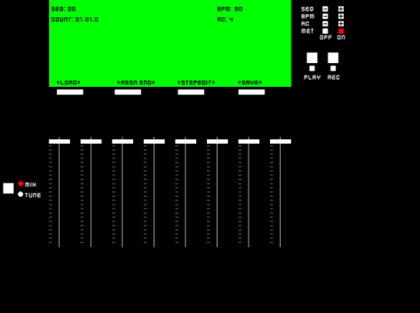

# pyDM404
The pyDM404 (or python Drum Machine 404) is a cross platform drum machine written in Python. The source code will run on any machine that can install its dependencies. Executable binaries are available for Windows (7/10) and Ubuntu Linux 20.04 LTS (Focal Fossa).

The pyDM404 is more of a toy application than a serious piece of software; a project to explore what one can create with Pygame. Miscellaneous bugs, the clunky user interface and other "features" impart a unique flavor to the application. The pyDM404 works great for drums, and can be used like old school samplers, such as the SP1200 or MPC60, to make whole beats.  

**UPDATE**: Version 1.2 is now out. See [Change Log](#Change-Log) for details and [releases](https://github.com/sitaber/pyDM404/releases) for the new executable



# Features
- Tuning algorithm based on the SP1200's. Adjust sounds by +/- 12 semitones
- Adjustable volume for each sound/channel
- Separate channels/choke groups, 8 in total (sounds in same group cut one another off)
- Up to 8 sounds loaded simultaneously
- A Metronome with clicks at fixed quarter note intervals
- Auto-correct: Quarter note, 8th note, 16th, 16th triplet, and "hi-rez" 32nd
- Real time recording
- "Step edit" mode (more like a clickable grid)
- Save and load with "disks"

# Installation
There are two ways to use pyDM404. 
1) Run an executable
2) Run from source

# 1. Executable
There is an executable available for Windows (7/8/10) and for Ubuntu Linux 20.04 LTS (Focal Fossa) that were packaged with [pyinstaller](https://pypi.org/project/pyinstaller/). To obtain the executable, go to the [release](https://github.com/sitaber/pyDM404/releases) page and download the proper zip file for your platform, unzip and open the unzipped folder. 
To run:
- `Windows`: Just double click `pydm404-win64.exe` and your good to go
- `Linux`: Make sure the program has permission to run
    - Press <kbd>Ctrl</kbd> + <kbd>Alt</kbd> + <kbd>T</kbd> to open the shell, navigate to the unzipped folder, change the file permissions for the executable, then run it
    ```bash
    $ cd path/to/extracted/folder
    $ chmod +x pydm404
    $ ./pydm404
    ```
**NOTE**: You must run the executable from the pyDM404 directory

## Quick Start
Now that you have the executable, how do you use pyDM404? See the quick start [manual](assets/QuickStart.pdf)

# 2. Run From Source
To run the source code you will need

- Python >= 3.7 
- Pygame >= 2.1.2
- NumPy >= 1.15 

Pygame and numpy provide almost everything for us to create the application, and what they don't, we implement with pure Python. 

## How it Works
The code is broken into 3 parts:
- `main.py`: Provides safe guard to run the application
- `app.py`: The nuts and bolts (one big file)
- `clock.py`: Sperate process launched from `app.py`. Modifed from
https://github.com/ElliotGarbus/MidiClockGenerator
    - To get good timings for the sequencer, we spawn a child process to run a clock that it synchronizes to. 

Once you have met all dependacies, download/clone the repo and run `main.py` to start the application

# Change Log
## Version 1.2
### Controls
- <kbd>SPACEBAR</kbd>: can now be used to toggle play
- <kbd>Q</kbd>, <kbd>W</kbd>, <kbd>E</kbd>, and <kbd>R</kbd>: can now be used to select LCD menu buttons
- Pressing <kbd>ESC</kbd> no longer closes the application when on the main screen

### GUI
- The **BLANK** disk is no longer displayed in the **LOAD/SAVE** menus
- Made GUI colors more consistent.
    - **LOAD/SAVE** menus: Made the selection boxes white when not selected and red when selected
    - **ASSN SND** menu: Made the selection boxes white when not selected and red when selected. Select-able sounds now have a green select box
    - **MAIN SCREEN**: **REC** button is no longer red
    

### BEHAVIOR
- Sequencer now stops playback when entering the **LOAD/SAVE** or **ASSN SND** menus
- **Changing sequence:** In version 1.0, changing the sequence was always immediate. In version 1.2, if the sequencer is stopped, changing the sequence is instant, but if the sequencer is _playing_, the next sequence will be "queued", indicated by a * next to the sequence number. Once the current sequence reaches its end, the queued sequence will take effect. Stopping playback before changing to a queued sequence will cause to the current sequence to remain active

### CODE
- Added checks to "cleanup" the clock process more effectively  
- Flattened large sections of the code to improve readability
- Moved related actions into Sequencer class as methods
  
# TODO
List of some ideas for continuing the project 

### Improvements:
- More intuitive/informative load and save screens
- Assign Sounds interface
    - Ability to press keyboard key for __PAD__ selection
    - Headers for columns to improve clarity (PAD, CHANNEL, SOUND)

### Features:
In no particular order
- Copy sequence to another sequence
- Adjustable sequence length
- Ability to type in BPM and save per sequence
- Song mode - select order of sequence playback
- Low pass filters that can be set on a channel
- True step edit / navigation with the arrow keys
- Multi-Pitch Mode: A sound can be pitched across the keyboard keys
- Multi-Level Mode: Each keyboard key plays assigned sound at different velocities
- Banks A-D: Have 32 sounds loaded instead of only 8
    - Requires changes to step edit grid
- Clickable Pads to play back sounds


